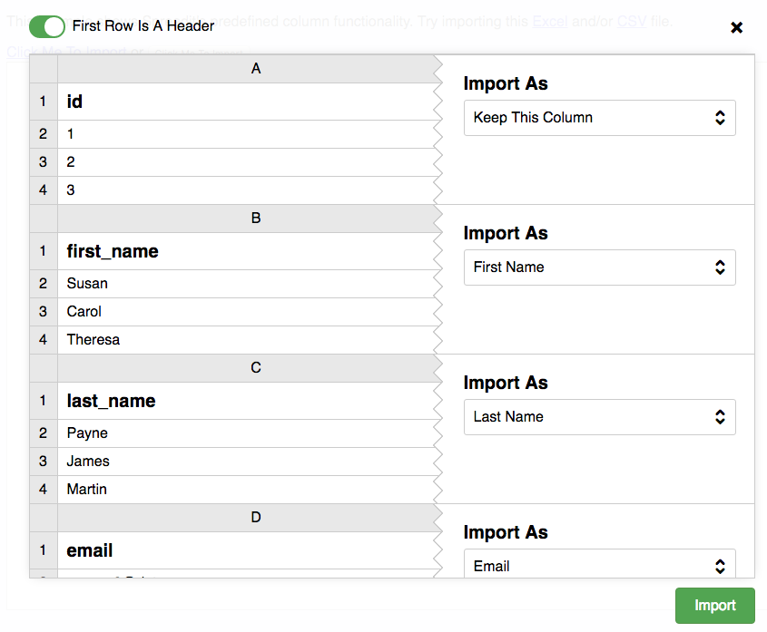

# Spreadit - Spreadsheet data importing simplified and 100% in the browser.

Spreadit is an angular directive inspired by the guys at [Conference Badge](https://www.conferencebadge.com/).  It converts data fom Excel or CSV to JSON so it
can be used in the browser or uploaded to the server.  It supports header and column detection.  Users can also rename and ignore columns before importing the data.




## Install It
* <a name="manual"></a>**Manual**: download latest from [here](https://github.com/blakgeek/spreadit/releases/latest)
* <a name="bower"></a>**Bower**: `bower install spreadit --save`
* <a name="npm"></a>**NPM**: `npm install spreadit`

## See It In Action
* [Basic Example](https://jsfiddle.net/blakgeek/vumyL0x1/)
* [Configure Columns](https://jsfiddle.net/blakgeek/q50cLjnz/)
* [Restrict Columns](https://jsfiddle.net/blakgeek/y2yfqydp/)

## Code Sample
HTML:
```html
<link href="spreadit.css" type="text/css" rel="stylesheet"/>

<script src="angular.min.js"></script>
<!-- needed to support csv -->
<script src="papaparse.min.js"></script>
<!-- needed to support Excel -->
<script src="xlsx.full.min.js"></script>
<script src="spreadit(.min).js"></script>

<button si-file-select="myId">Click Me To Import</button>
<si-column-manager
    si-id="myId"
    si-columns="columnConfigs"
    si-exclude-unknown-columns="false"
    si-sample-size="5"
    si-allow-renaming="true"
    si-change="doStuffWithData($data, $file, $type)">
</si-column-manager>
```
Javascript:
```js
//inject directives and services.
var app = angular.module('superDopeDemo', ['bg.spreadit']);

app.controller('MyCtrl', ['$scope', function ($scope, Upload) {

    $scope.doStuffWithData = function(data, file, type) {

        console.log('file type: %s', type);
        console.log(data);
    };
}]);
```